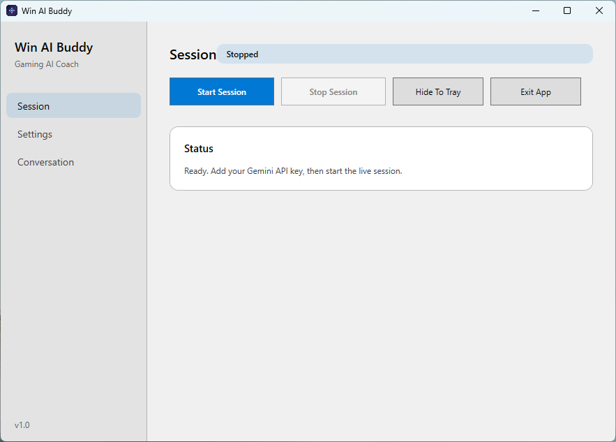
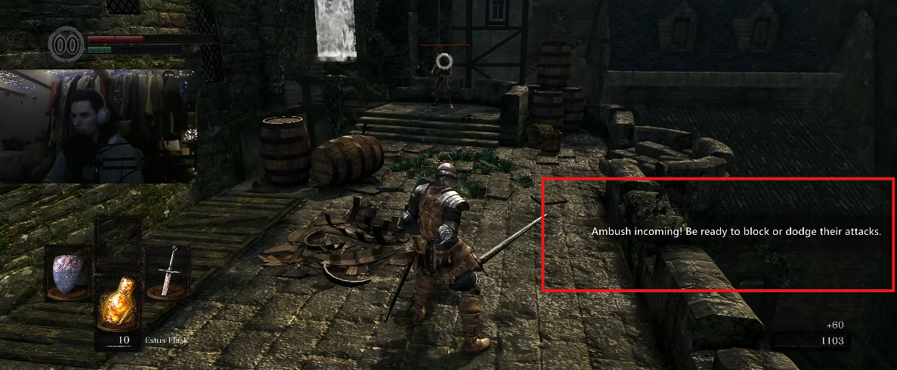
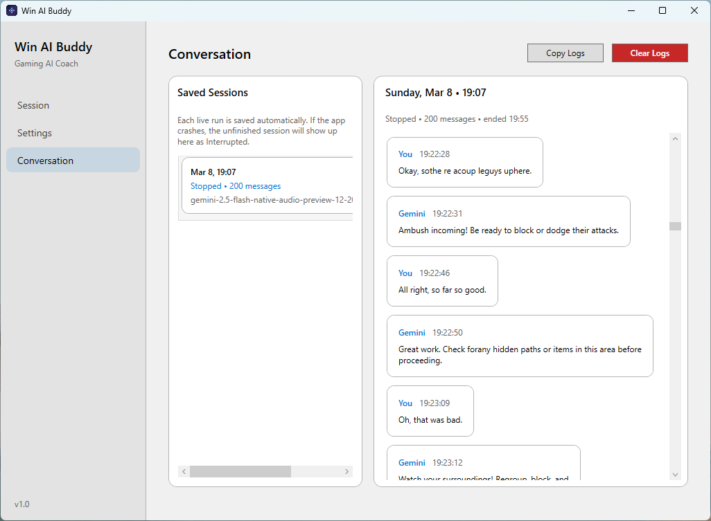
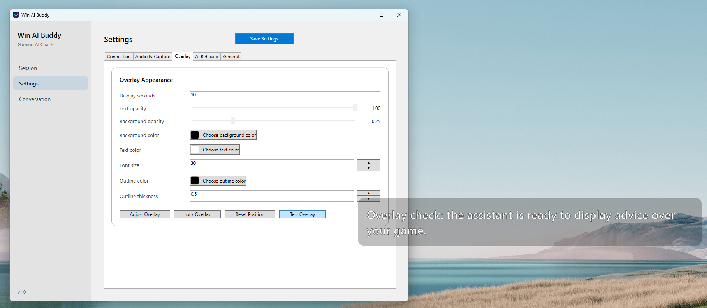

# Win AI Buddy for Gaming

Windows desktop app for live Gemini-powered gaming help. It keeps a Gemini Live session open, streams microphone audio and optional screen frames, plays streamed model audio, and shows transcription text in an in-game overlay.

[Download the latest release](https://github.com/WiegerWolf/win-ai-buddy-for-gaming/releases/latest)

## Showcase

Watch the app in action: [YouTube showcase](https://youtu.be/KWATSGGqDfc?si=hlTvdpz91TvQQHeM&t=96)

## Highlights

- WPF desktop shell with a tray-friendly live session controller
- Transparent always-on-top overlay for assistant answers
- Continuous microphone streaming
- Optional screen-frame streaming
- Direct Gemini Live integration with the official `Google.GenAI` .NET SDK
- Streamed PCM audio playback for model responses
- Conversation history with restorable saved sessions after stop or crash

## Screenshots

### Main app

### Audio and capture settings

### Conversation history

### In-game overlay

## Stack

- .NET 8
- WPF
- Google Gemini Live API via `Google.GenAI`
- `NAudio` for microphone capture and streamed playback

## Run it

1. Open [WinAiBuddy.sln](C:\Users\n\Documents\win-ai-buddy-for-gaming\WinAiBuddy.sln) in Visual Studio 2022 or later.
2. Restore NuGet packages.
3. Build and run the `WinAiBuddy` project.
4. Add your Gemini API key in the app window.
5. Click `Start Live` to open the live session.

## Settings file

The app persists settings to:

- `%LocalAppData%\WinAiBuddy\appsettings.json`

An example config is included at [appsettings.example.json](C:\Users\n\Documents\win-ai-buddy-for-gaming\src\WinAiBuddy\appsettings.example.json).

## Automated releases

GitHub Actions publishes Windows release zips automatically:

- Push a git tag: creates a tagged release in GitHub Releases
- Run the workflow manually: creates a prerelease build in GitHub Releases

## Gemini Live flow

The app currently uses one Gemini Live session:

1. The app streams microphone audio continuously.
2. If enabled, it also streams low-rate JPEG screen frames as video input.
3. Gemini returns audio output plus transcription events.
4. The app plays the streamed PCM audio and shows transcribed output in the overlay.

Defaults:

- `LiveModel`: `gemini-2.5-flash-native-audio-preview-12-2025`
- `Voice`: `Kore`
- `ScreenCaptureIntervalMs`: `1000`

## Notes

- This version uses the official .NET Live API rather than a separate gateway or TTS step.
- Gemini Live sessions can only use one response modality per session. This app uses `AUDIO` plus transcription events for text display.
- Per the current Live API docs, audio plus video sessions are shorter-lived than audio-only sessions, so long-running play sessions may need reconnect logic in a future pass.
- Competitive games with anti-cheat may block capture or overlays.
- The overlay works best with windowed or borderless fullscreen games. True exclusive fullscreen games may stay above normal desktop overlays, so the overlay might not appear there.
- The current MVP captures the primary monitor instead of a specific game window.
